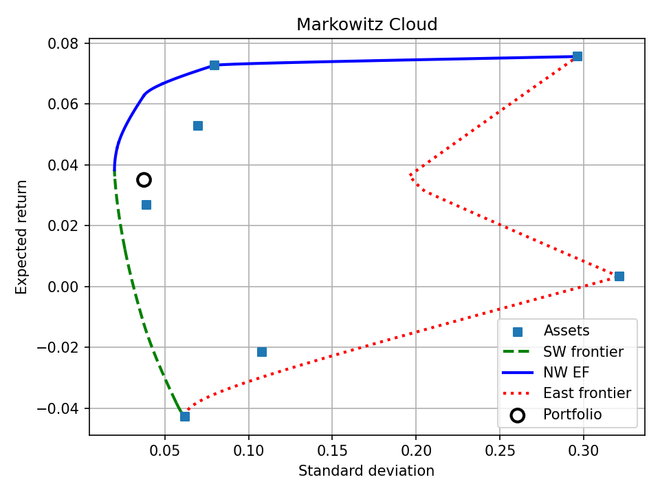
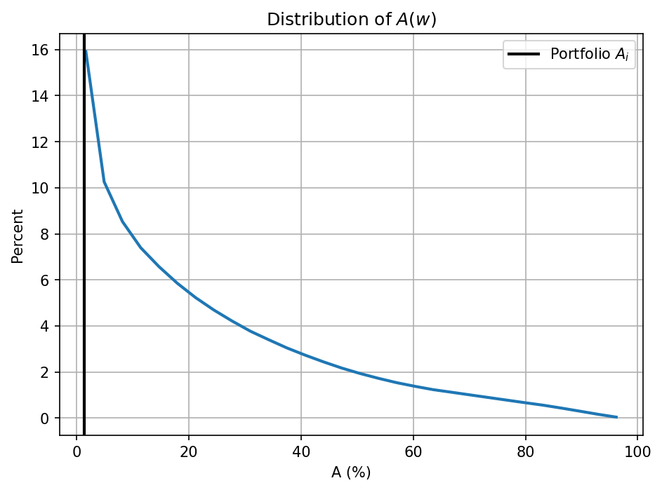

# Example: Florida, 2013 Tax Revenue Portfolio

[← Back to README](README.md) · See also: [Example_Georgia.md](Example_Georgia.md)

Full worked example using Florida's actual 2013 state tax revenue allocation — seven consolidated tax sources (General Sales and Gross Receipts, Motor Fuels, Public Utilities, Motor Vehicles License, Corporation Net Income, Documentary and Stock Transfer, and a residual "Other" category), replicated from Bartsch (2026), *Evaluating State Tax Portfolio Performance* (Tables I–II). Every output block below was produced by actually running the current code against this data — see the [API Reference](README.md#api-reference) for what each argument and return value means.

```python
import numpy as np
import frontier_segments.frontier_segments as fs

mu_FL = np.array([0.05276470, 0.02682330, -0.04290579, 0.00324054, 0.07567413, 0.07280222, -0.02156569])
Sigma_FL = np.array([
    [ 0.00485792, -0.00157171,  0.00159901, -0.00365031, -0.00884294, -0.00273095,  0.00063458],
    [-0.00157171,  0.00154277, -0.00001197,  0.00083865,  0.00489197,  0.00097558, -0.00048200],
    [ 0.00159901, -0.00001197,  0.00386485,  0.00343006, -0.00307507,  0.00025817,  0.00147944],
    [-0.00365031,  0.00083865,  0.00343006,  0.10311208, -0.02053603,  0.00922207,  0.01254319],
    [-0.00884294,  0.00489197, -0.00307507, -0.02053603,  0.08775540,  0.00983462, -0.01140220],
    [-0.00273095,  0.00097558,  0.00025817,  0.00922207,  0.00983462,  0.00634532, -0.00082666],
    [ 0.00063458, -0.00048200,  0.00147944,  0.01254319, -0.01140220, -0.00082666,  0.01164442],
])
w_o = np.array([0.56792109, 0.09260748, 0.07821379, 0.04017905, 0.05344698, 0.05754798, 0.11008363])

cloud = fs.compute_cloud(mu_FL, Sigma_FL, verbose=True)
```

Assets, in order: **T09** General Sales and Gross Receipts Taxes, **T13** Motor Fuels Sales Tax, **T15** Public Utilities Sales Tax, **T24** Motor Vehicles License, **T41** Corporation Net Income Taxes, **T51** Documentary and Stock Transfer Taxes, **Other**.

**`compute_cloud` verbose output:**

```
N         : 7
r_global  : 0.038389
mu        : [ 0.0527647   0.0268233  -0.04290579  0.00324054  0.07567413  0.07280222
 -0.02156569]
Sigma     :
[[ 4.8579200e-03 -1.5717100e-03  1.5990100e-03 -3.6503100e-03
  -8.8429400e-03 -2.7309500e-03  6.3458000e-04]
 [-1.5717100e-03  1.5427700e-03 -1.1970000e-05  8.3865000e-04
   4.8919700e-03  9.7558000e-04 -4.8200000e-04]
 [ 1.5990100e-03 -1.1970000e-05  3.8648500e-03  3.4300600e-03
  -3.0750700e-03  2.5817000e-04  1.4794400e-03]
 [-3.6503100e-03  8.3865000e-04  3.4300600e-03  1.0311208e-01
  -2.0536030e-02  9.2220700e-03  1.2543190e-02]
 [-8.8429400e-03  4.8919700e-03 -3.0750700e-03 -2.0536030e-02
   8.7755400e-02  9.8346200e-03 -1.1402200e-02]
 [-2.7309500e-03  9.7558000e-04  2.5817000e-04  9.2220700e-03
   9.8346200e-03  6.3453200e-03 -8.2666000e-04]
 [ 6.3458000e-04 -4.8200000e-04  1.4794400e-03  1.2543190e-02
  -1.1402200e-02 -8.2666000e-04  1.1644420e-02]]
chol_L    :
[[ 0.06969878  0.          0.          0.          0.          0.
   0.        ]
 [-0.02255004  0.03216     0.          0.          0.          0.
   0.        ]
 [ 0.02294172  0.01571413  0.0556021   0.          0.          0.
   0.        ]
 [-0.05237265 -0.01064537  0.0863072   0.3046423   0.          0.
   0.        ]
 [-0.12687367  0.06315186 -0.02080401 -0.08112114  0.24628615  0.
   0.        ]
 [-0.03918218  0.00286133  0.02000128  0.01796927  0.02662159  0.05805372
   0.        ]
 [ 0.00910461 -0.00860357  0.02528254  0.03527537 -0.02564569 -0.01553959
   0.09329934]]
segments  : 17 total
  active_set           lower_r     upper_r   ef   sw   ea
  -------------------------------------------------------
  (2, 6)             -0.042906   -0.041125    0    1    0
  (2, 4, 6)          -0.041125   -0.038318    0    1    0
  (1, 2, 4, 6)       -0.038318   -0.010599    0    1    0
  (0, 1, 2, 4, 6)    -0.010599    0.012198    0    1    0
  (0, 1, 2, 4, 5, 6)    0.012198    0.036230    0    1    0
  (0, 1, 2, 5, 6)     0.036230    0.036568    0    1    0
  (0, 1, 5, 6)        0.036568    0.038389    0    1    0
  (0, 1, 5, 6)        0.038389    0.045563    1    0    0
  (0, 1, 5)           0.045563    0.047410    1    0    0
  (0, 1, 4, 5)        0.047410    0.062814    1    0    0
  (0, 4, 5)           0.062814    0.066723    1    0    0
  (0, 5)              0.066723    0.072802    1    0    0
  (4, 5)              0.072802    0.075674    1    0    0
  (2, 3)             -0.042906    0.003241    0    0    1
  (3, 5)              0.003241    0.031378    0    0    1
  (3, 4)              0.031378    0.036534    0    0    1
  (2, 4)              0.036534    0.075674    0    0    1
```

```python
ap = fs.absolute_performance(cloud, w_o, verbose=True)
```

**`absolute_performance` verbose output:**

```
--- absolute_performance ---
  rf = 0.000000
           asset |   w_o    |     Max r|Same sd          Min sd|Same r             Min Var              Max Return             Max Sharpe             EF Min Diss      
  ---------------------------------------------------------------------------------------------------------------------------------------------------------------------
               r | 0.035085 |  0.062888  +0.027803 |  0.035085  +0.000000 |  0.038389  +0.003304 |  0.075674  +0.040589 |  0.046121  +0.011036 |  0.059138  +0.024054 |
              sd | 0.037644 |  0.037644  +0.000000 |  0.020311  -0.017334 |  0.020020  -0.017624 |  0.296235  +0.258591 |  0.021841  -0.015803 |  0.033234  -0.004410 |
          sharpe | 0.932004 |  1.670582  +0.738578 |  1.727417  +0.795413 |  1.917536  +0.985532 |  0.255453  -0.676551 |  2.111622  +1.179618 |  1.779456  +0.847452 |
  ---------------------------------------------------------------------------------------------------------------------------------------------------------------------
  weights      0 | 0.567921 |  0.497526  -0.070395 |  0.291774  -0.276147 |  0.313006  -0.254915 |  0.000000  -0.567921 |  0.367609  -0.200313 |  0.471546  -0.096375 |
               1 | 0.092607 |  0.000000  -0.092607 |  0.534941  +0.442333 |  0.514495  +0.421888 |  0.000000  -0.092607 |  0.420091  +0.327483 |  0.092607  +0.000000 |
               2 | 0.078214 |  0.000000  -0.078214 |  0.013460  -0.064753 |  0.000000  -0.078214 |  0.000000  -0.078214 |  0.000000  -0.078214 |  0.000000  -0.078214 |
               3 | 0.040179 |  0.000000  -0.040179 |  0.000000  -0.040179 |  0.000000  -0.040179 |  0.000000  -0.040179 |  0.000000  -0.040179 |  0.000000  -0.040179 |
               4 | 0.053447 |  0.019165  -0.034282 |  0.000267  -0.053180 |  0.000000  -0.053447 |  1.000000  +0.946553 |  0.000000  -0.053447 |  0.014872  -0.038575 |
               5 | 0.057548 |  0.483309  +0.425761 |  0.098962  +0.041414 |  0.124968  +0.067420 |  0.000000  -0.057548 |  0.212301  +0.154753 |  0.420975  +0.363427 |
               6 | 0.110084 |  0.000000  -0.110084 |  0.060596  -0.049487 |  0.047531  -0.062553 |  0.000000  -0.110084 |  0.000000  -0.110084 |  0.000000  -0.110084 |
```

```python
qr = fs.quasi_relative_performance(cloud, w_o, verbose=True)
```

**`quasi_relative_performance` verbose output:**

```
--- quasi_relative_performance ---
            stat |   w_o    |     Max r|Same sd          Min sd|Same r             Min Var              Max Return             Max Sharpe             EF Min Diss      
  ---------------------------------------------------------------------------------------------------------------------------------------------------------------------
           rho_r | 0.631246 |  1.000000  +0.368754 |  1.000000  +0.368754 |  1.000000  +0.368754 |  1.000000  +0.368754 |  1.000000  +0.368754 |  1.000000  +0.368754 |
          rho_sd | 0.902472 |  1.000000  +0.097528 |  1.000000  +0.097528 |  1.000000  +0.097528 |  1.000000  +0.097528 |  1.000000  +0.097528 |  1.000000  +0.097528 |
  ---------------------------------------------------------------------------------------------------------------------------------------------------------------------
         gamma_r | 0.657704 |  0.892174  +0.234469 |  0.657704  -0.000000 |  0.685570  +0.027866 |  1.000000  +0.342296 |  0.750774  +0.093070 |  0.860551  +0.202847 |
        gamma_sd | 0.941465 |  0.941465  -0.000000 |  0.999035  +0.057570 |  1.000000  +0.058535 |  0.082617  -0.858847 |  0.993950  +0.052486 |  0.956113  +0.014648 |
    gamma_sharpe | 0.578976 |  0.842586  +0.263610 |  0.862871  +0.283895 |  0.930728  +0.351752 |  0.337504  -0.241472 |  1.000000  +0.421024 |  0.881445  +0.302469 |
  ---------------------------------------------------------------------------------------------------------------------------------------------------------------------
   dissimilarity | 0.000000 |  0.425761            |  0.483747            |  0.489308            |  0.946553            |  0.482236            |  0.363427            |
```

**Reading the table.** Florida's 2013 allocation scores `gamma_r = 0.658` — its revenue growth sits mid-pack within the feasible set, well above Georgia's `gamma_r = 0.266` — while `gamma_sd = 0.941` shows its risk is nonetheless close to the global minimum. `gamma_sharpe = 0.579` is the more revealing number: Florida's realized Sharpe ratio sits only just past the halfway point of what was achievable, versus Georgia's `0.667`, and the dissimilarity column shows every reference allocation would require reweighting at least 36% of the portfolio (`D ≥ 0.363`) to reach — noticeably more reform than any of Georgia's reference allocations required.

```python
rp = fs.relative_performance(cloud, w_o, reference=True, verbose=True)
```

**`relative_performance` verbose output:**

```
--- relative_performance ---
            stat |   w_o    |     Max r|Same sd          Min sd|Same r             Min Var              Max Return             Max Sharpe             EF Min Diss      
  ---------------------------------------------------------------------------------------------------------------------------------------------------------------------
       P_r_minus | 0.759517 |  0.998845  +0.239328 |  0.759517  -0.000000 |  0.823521  +0.064004 |  1.000000  +0.240483 |  0.931314  +0.171797 |  0.995623  +0.236106 |
    P_sigma_plus | 0.955791 |  0.955791  -0.000000 |  1.000000  +0.044209 |  1.000000  +0.044209 |  0.000000  -0.955791 |  1.000000  +0.044209 |  0.984612  +0.028822 |
  P_sharpe_minus | 0.968665 |  1.000000  +0.031335 |  1.000000  +0.031335 |  1.000000  +0.031335 |  0.428685  -0.539980 |  1.000000  +0.031335 |  1.000000  +0.031335 |
             A_i | 0.014353 |  0.000000  -0.014353 |  0.000000  -0.014353 |  0.000000  -0.014353 |  0.000000  -0.014353 |  0.000000  -0.014353 |  0.000000  -0.014353 |
             F_i | 0.720270 |  0.955791  +0.235520 |  0.750126  +0.029856 |  0.804633  +0.084362 |  0.000000  -0.720270 |  0.920194  +0.199924 |  0.984612  +0.264342 |
  ---------------------------------------------------------------------------------------------------------------------------------------------------------------------
             Q_A | 0.874951 |  1.000000  +0.125049 |  1.000000  +0.125049 |  1.000000  +0.125049 |  1.000000  +0.125049 |  1.000000  +0.125049 |  1.000000  +0.125049 |
             Q_F | 0.959751 |  0.998789  +0.039038 |  0.968800  +0.009049 |  0.981008  +0.021257 |  0.047523  -0.912228 |  0.996842  +0.037090 |  0.999780  +0.040029 |
```

`reference=True` picked a lattice resolution of `k=26` (`_simplex_grid: k=26, points=906192`), auto-derived from the default `n_points=1_000_000` for this 7-asset feasible set — matching the resolution reported in Bartsch (2026), Table V. Florida's 2013 allocation is dominated by `A_i = 1.4%` of the feasible simplex — an order of magnitude more than Georgia's `0.09%` — and itself dominates `F_i = 72.0%` of it, exactly the contrast the paper draws out directly: Florida's observed allocation is "strictly superior to" 72% of feasible allocations, versus Georgia's 30.2%.

```python
fs.plot_cloud(cloud, weights=w_o)
```

**Plot:**



```python
fs.q_plot(cloud, weights=w_o, stat="A")
```

**Plot — distribution of `A(w)` over the feasible simplex, with Florida's 2013 `A_i` marked:**



About 4.7% of the simplex has `A(w) ≈ 0` (i.e. also sits on the EF) — less than half Georgia's 10.3% share, consistent with Florida's more elongated, less densely-EF-adjacent feasible set. The observed allocation's own `A_i ≈ 1.4%` still lands near the left edge of the distribution, but visibly farther from zero than Georgia's did.

---

[← Back to README](README.md) · See also: [Example_Georgia.md](Example_Georgia.md)
