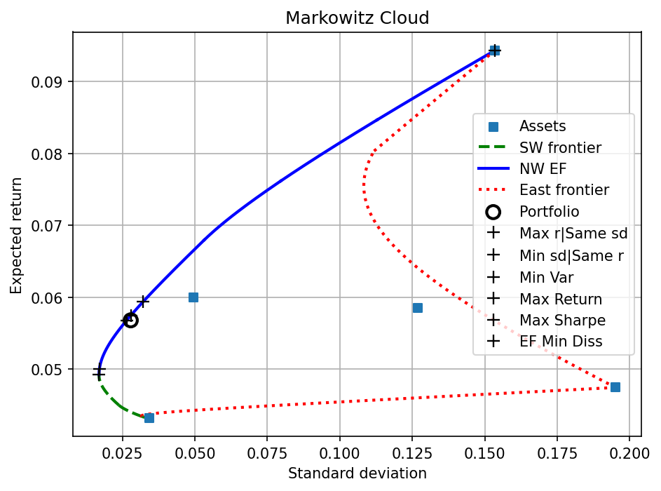
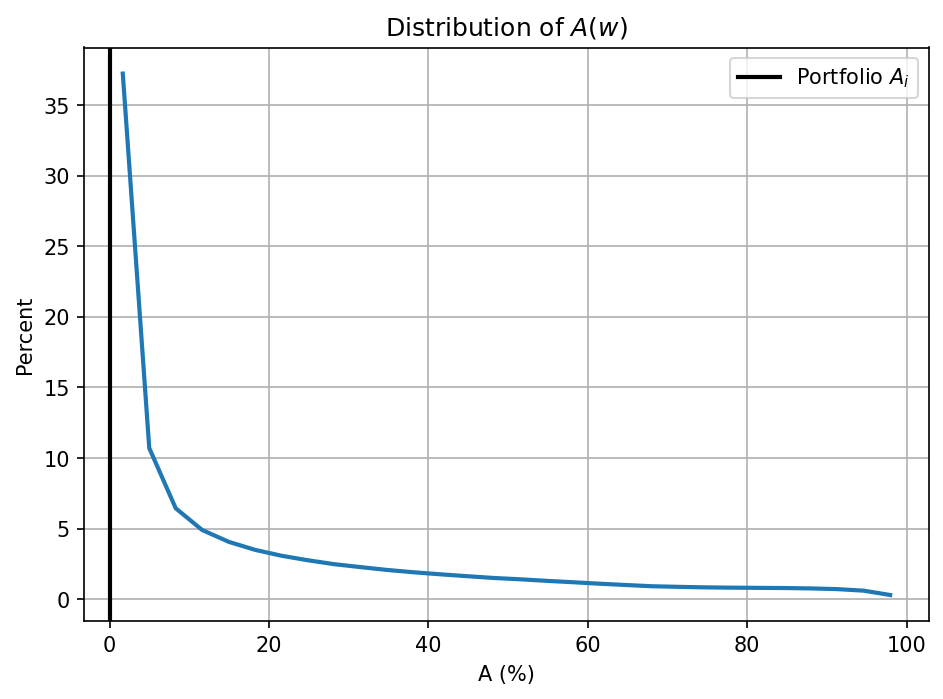

# Example: Georgia, 2013 Tax Revenue Portfolio

[← Back to README](README.md) · See also: [Example_Florida.md](Example_Florida.md)

Full worked example using Georgia's actual 2013 state tax revenue allocation — five consolidated tax sources (General Sales and Gross Receipts, Motor Fuels, Individual Income, Corporation Net Income, and a residual "Other" category), replicated from Bartsch (2026), *Evaluating State Tax Portfolio Performance* (Tables I–II). Every output block below was produced by actually running the current code against this data — see the [API Reference](README.md#api-reference) for what each argument and return value means.

```python
import numpy as np
import frontier_segments.frontier_segments as fs

mu_GA = np.array([0.04321064, 0.09432582, 0.05994018, 0.04744774, 0.05847559])
Sigma_GA = np.array([
    [ 0.00117476, -0.00005078, -0.00047024, -0.00156685, -0.00228487],
    [-0.00005078,  0.02358429,  0.00088930, -0.00595364,  0.00263467],
    [-0.00047024,  0.00088930,  0.00245991, -0.00055711, -0.00010694],
    [-0.00156685, -0.00595364, -0.00055711,  0.03806298, -0.00113346],
    [-0.00228487,  0.00263467, -0.00010694, -0.00113346,  0.01611126],
])
w_o = np.array([0.27856823, 0.06649115, 0.49736724, 0.04979834, 0.10777504])

cloud = fs.compute_cloud(mu_GA, Sigma_GA, verbose=True)
```

Assets, in order: **T09** General Sales and Gross Receipts Taxes, **T13** Motor Fuels Sales Tax, **T40** Individual Income Taxes, **T41** Corporation Net Income Taxes, **Other**.

**`compute_cloud` verbose output:**

```
N         : 5
r_global  : 0.049239
mu        : [0.04321064 0.09432582 0.05994018 0.04744774 0.05847559]
Sigma     :
[[ 1.174760e-03 -5.078000e-05 -4.702400e-04 -1.566850e-03 -2.284870e-03]
 [-5.078000e-05  2.358429e-02  8.893000e-04 -5.953640e-03  2.634670e-03]
 [-4.702400e-04  8.893000e-04  2.459910e-03 -5.571100e-04 -1.069400e-04]
 [-1.566850e-03 -5.953640e-03 -5.571100e-04  3.806298e-02 -1.133460e-03]
 [-2.284870e-03  2.634670e-03 -1.069400e-04 -1.133460e-03  1.611126e-02]]
chol_L    :
[[ 0.03427477  0.          0.          0.          0.        ]
 [-0.00148156  0.15356463  0.          0.          0.        ]
 [-0.01371971  0.00565868  0.04732503  0.          0.        ]
 [-0.04571438 -0.03921065 -0.02033633  0.1844509   0.        ]
 [-0.06666332  0.0165136  -0.02356019 -0.02175403  0.10181475]]
segments  : 11 total
  active_set           lower_r     upper_r   ef   sw   ea
  -------------------------------------------------------
  (0, 3)              0.043211    0.043393    0    1    0
  (0, 3, 4)           0.043393    0.044985    0    1    0
  (0, 2, 3, 4)        0.044985    0.049076    0    1    0
  (0, 1, 2, 3, 4)     0.049076    0.049239    0    1    0
  (0, 1, 2, 3, 4)     0.049239    0.067958    1    0    0
  (1, 2, 3, 4)        0.067958    0.076171    1    0    0
  (1, 2, 3)           0.076171    0.084663    1    0    0
  (1, 2)              0.084663    0.094326    1    0    0
  (0, 3)              0.043211    0.047448    0    0    1
  (1, 3)              0.047448    0.080324    0    0    1
  (0, 1)              0.080324    0.094326    0    0    1
```

```python
ap = fs.absolute_performance(cloud, w_o, verbose=True)
```

**`absolute_performance` verbose output:**

```
--- absolute_performance ---
  rf = 0.000000
           asset |   w_o    |     Max r|Same sd          Min sd|Same r             Min Var              Max Return             Max Sharpe             EF Min Diss      
  ---------------------------------------------------------------------------------------------------------------------------------------------------------------------
               r | 0.056786 |  0.057460  +0.000674 |  0.056786  +0.000000 |  0.049239  -0.007547 |  0.094326  +0.037540 |  0.050042  -0.006744 |  0.059341  +0.002555 |
              sd | 0.027903 |  0.027903  +0.000000 |  0.026483  -0.001420 |  0.016950  -0.010953 |  0.153572  +0.125669 |  0.017087  -0.010815 |  0.032081  +0.004178 |
          sharpe | 2.035166 |  2.059305  +0.024139 |  2.144257  +0.109091 |  2.905021  +0.869855 |  0.614213  -1.420952 |  2.928601  +0.893436 |  1.849741  -0.185425 |
  ---------------------------------------------------------------------------------------------------------------------------------------------------------------------
  weights      0 | 0.278568 |  0.339401  +0.060833 |  0.361176  +0.082608 |  0.605161  +0.326593 |  0.000000  -0.278568 |  0.579214  +0.300646 |  0.278568  -0.000000 |
               1 | 0.066491 |  0.113104  +0.046613 |  0.104017  +0.037526 |  0.002198  -0.064293 |  1.000000  +0.933509 |  0.013026  -0.053465 |  0.138491  +0.071999 |
               2 | 0.497367 |  0.414764  -0.082604 |  0.400881  -0.096486 |  0.245330  -0.252037 |  0.000000  -0.497367 |  0.261872  -0.235495 |  0.453547  -0.043820 |
               3 | 0.049798 |  0.045079  -0.004720 |  0.044630  -0.005169 |  0.039601  -0.010197 |  0.000000  -0.049798 |  0.040136  -0.009662 |  0.046332  -0.003466 |
               4 | 0.107775 |  0.087653  -0.020122 |  0.089296  -0.018479 |  0.107710  -0.000065 |  0.000000  -0.107775 |  0.105751  -0.002024 |  0.083062  -0.024713 |
```

```python
qr = fs.quasi_relative_performance(cloud, w_o, verbose=True)
```

**`quasi_relative_performance` verbose output:**

```
--- quasi_relative_performance ---
            stat |   w_o    |     Max r|Same sd          Min sd|Same r             Min Var              Max Return             Max Sharpe             EF Min Diss      
  ---------------------------------------------------------------------------------------------------------------------------------------------------------------------
           rho_r | 0.949825 |  1.000000  +0.050175 |  1.000000  +0.050175 |  1.000000  +0.050175 |  1.000000  +0.050175 |  1.000000  +0.050175 |  1.000000  +0.050175 |
          rho_sd | 0.988790 |  1.000000  +0.011210 |  1.000000  +0.011210 |  1.000000  +0.011210 |  1.000000  +0.011210 |  1.000000  +0.011210 |  1.000000  +0.011210 |
  ---------------------------------------------------------------------------------------------------------------------------------------------------------------------
         gamma_r | 0.265589 |  0.278766  +0.013177 |  0.265589  +0.000000 |  0.117941  -0.147647 |  1.000000  +0.734411 |  0.133643  -0.131945 |  0.315579  +0.049990 |
        gamma_sd | 0.938518 |  0.938518  +0.000000 |  0.946487  +0.007969 |  1.000000  +0.061482 |  0.233096  -0.705422 |  0.999228  +0.060709 |  0.915063  -0.023455 |
    gamma_sharpe | 0.667299 |  0.676288  +0.008989 |  0.707923  +0.040624 |  0.991219  +0.323920 |  0.138159  -0.529140 |  1.000000  +0.332701 |  0.598250  -0.069049 |
  ---------------------------------------------------------------------------------------------------------------------------------------------------------------------
   dissimilarity | 0.000000 |  0.107446            |  0.120134            |  0.326593            |  0.933509            |  0.300646            |  0.071999            |
```

**Reading the table.** Each column is a reference portfolio. Signed deltas show how that portfolio's score differs from `w_o`. The `rho` rows are each 1.0 for every frontier portfolio by construction — they serve as a sanity check that the frontier point was found correctly. The `gamma` rows are unconditional: `gamma_r = 1` only for the single asset with the highest expected return, `gamma_sd = 1` only for the MVP, and `gamma_sharpe = 1` only for the tangency (Max Sharpe) portfolio. Georgia's 2013 allocation scores `gamma_r = 0.266` — its revenue growth was far below what was achievable elsewhere in the feasible set — despite scoring `gamma_sd = 0.939` (risk close to the global minimum) and a moderate `gamma_sharpe = 0.667`, illustrating that low absolute growth need not reflect a policy defect: greater growth was possible, but only at higher volatilities than were realized.

```python
rp = fs.relative_performance(cloud, w_o, reference=True, verbose=True)
```

**`relative_performance` verbose output:**

```
--- relative_performance ---
            stat |   w_o    |     Max r|Same sd          Min sd|Same r             Min Var              Max Return             Max Sharpe             EF Min Diss      
  ---------------------------------------------------------------------------------------------------------------------------------------------------------------------
       P_r_minus | 0.336172 |  0.378136  +0.041964 |  0.336172  +0.000000 |  0.023505  -0.312667 |  1.000000  +0.663828 |  0.037717  -0.298454 |  0.492899  +0.156727 |
    P_sigma_plus | 0.963684 |  0.963684  +0.000000 |  0.971798  +0.008115 |  1.000000  +0.036316 |  0.001719  -0.961964 |  0.999994  +0.036310 |  0.935352  -0.028331 |
  P_sharpe_minus | 0.975284 |  0.977184  +0.001900 |  0.983042  +0.007757 |  0.999990  +0.024706 |  0.089137  -0.886147 |  1.000000  +0.024716 |  0.956126  -0.019158 |
             A_i | 0.000183 |  0.000000  -0.000183 |  0.000000  -0.000183 |  0.000000  -0.000183 |  0.000000  -0.000183 |  0.000000  -0.000183 |  0.000000  -0.000183 |
             F_i | 0.300007 |  0.341805  +0.041798 |  0.307936  +0.007929 |  0.023481  -0.276525 |  0.001719  -0.298288 |  0.037738  -0.262269 |  0.428200  +0.128193 |
  ---------------------------------------------------------------------------------------------------------------------------------------------------------------------
             Q_A | 0.974943 |  1.000000  +0.025057 |  1.000000  +0.025057 |  1.000000  +0.025057 |  1.000000  +0.025057 |  1.000000  +0.025057 |  1.000000  +0.025057 |
             Q_F | 0.762596 |  0.833004  +0.070409 |  0.776439  +0.013844 |  0.083299  -0.679297 |  0.010054  -0.752542 |  0.126737  -0.635859 |  0.941064  +0.178468 |

  M = 4,194,304 Sobol points (deterministic, unscrambled)
  gauge: P_r_minus exact 0.336172 vs Sobol 0.336133, gap -3.92e-05
  convergence |stat(M) - stat(M/4)|:  A_i 2.1e-06  F_i 6.7e-06  Q_A 1.3e-04  Q_F 8.8e-05
```

The point set is 2²² = 4,194,304 Sobol points, the default. Georgia's 2013 allocation is dominated by only `A_i = 0.018%` of the feasible simplex, and itself dominates `F_i = 30.0%` of it — the allocation sits almost exactly on the efficient frontier (visible in the plot below), while still being strictly superior to nearly a third of all other feasible tax-source weightings.

The convergence line under the table is the error estimate: each statistic's movement over a fourfold increase in points. Here `A_i` moves 2.1×10⁻⁶ and `Q_A` 1.3×10⁻⁴. The gauge line is a second, independent check — `P_r_minus` counted on the point set against its exactly known convex-hull value, which agree to 3.9×10⁻⁵.

```python
fs.plot_cloud(cloud, weights=w_o)
```

**Plot:**



```python
fs.q_plot(cloud, weights=w_o, stat="A")
```

**Plot — distribution of `A(w)` over the feasible simplex, with Georgia's 2013 `A_i` marked:**



About 0.037% of the point set is itself non-dominated — the set's own Pareto frontier, which approximates the EF and shrinks toward the EF's true measure of zero as the point count rises. The observed allocation's own `A_i ≈ 0.018%` lands at the very left edge of the distribution, consistent with the near-zero value in the table above.

---

[← Back to README](README.md) · See also: [Example_Florida.md](Example_Florida.md)
