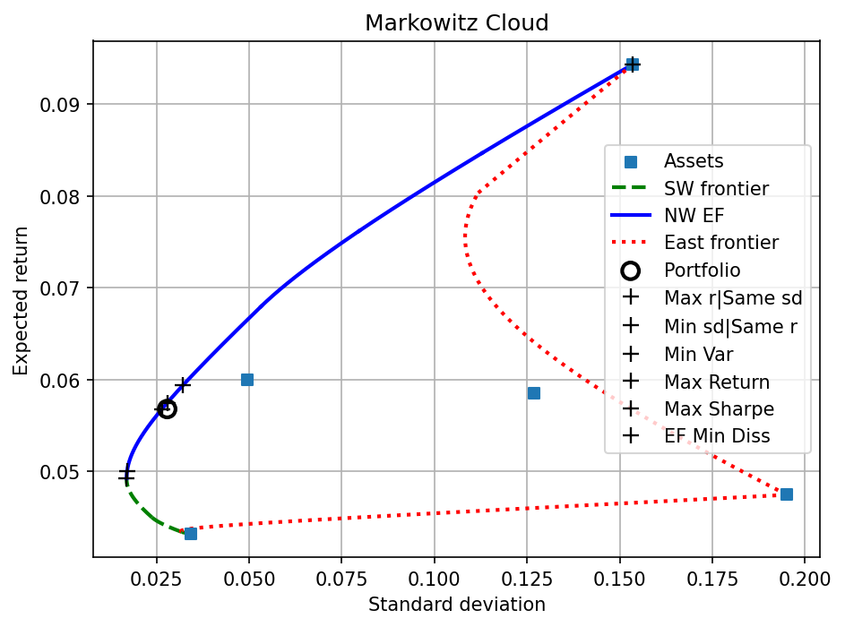

# frontier_segments

**Portfolio Efficient Frontiers & Diagnostics for Python**

A Python package for exact Markowitz mean-variance frontier computation and portfolio performance analysis. Given a vector of expected returns and a covariance matrix, `frontier_segments` traces all three frontier branches — the northwest efficient frontier (NW EF), the southwest minimum-variance frontier (SW), and the east variance-maximizing frontier (EA) — and provides a suite of absolute, quasi-relative, and relative performance measures for any observed portfolio.

---

## Installation

```bash
pip install git+https://github.com/zacharybartsch/frontier_segments.git
```

**Dependencies:** `numpy`, `scipy`, `matplotlib`

---

## Quick Start

```python
import numpy as np
import frontier_segments.frontier_segments as fs

# Three-asset example
mu    = np.array([0.2044, 0.1579, 0.095])
Sigma = np.array([
    [0.00024086, 0.00005642, 0.00008801],
    [0.00005642, 0.00011336, 0.00006400],
    [0.00008801, 0.00006400, 0.00015271],
])

w_o   = np.array([0.20, 0.40, 0.40])   # observed portfolio
w_ref = np.array([0.17, 0.60, 0.23])   # optional benchmark

# Step 1: compute frontiers once
cloud = fs.compute_cloud(mu, Sigma)

# Step 2: run diagnostics
ap = fs.absolute_performance(cloud, w_o, reference_weights=w_ref, verbose=True)
qr = fs.quasi_relative_performance(cloud, w_o, w_ref=w_ref, verbose=True)
rp = fs.relative_performance(cloud, w_o, w_ref=w_ref, verbose=True)

# Step 3: visualize
fs.plot_cloud(cloud, weights=w_o, ref_weights=w_ref)
```

---

## The Markowitz Cloud

`frontier_segments` partitions the feasible portfolio space into three frontier branches:

| Branch | Flag key | Description |
|--------|----------|-------------|
| **NW efficient frontier** | `ef_frontier` | Minimizes variance at each return level above the global minimum |
| **SW frontier** | `low_frontier` | Minimizes variance at each return level *below* the global minimum |
| **East (EA) frontier** | `ea_frontier` | Maximizes variance at each return level (outer boundary of the feasible cloud) |

Each branch is represented as a list of piecewise-parabolic segments. A segment records its active asset set, return interval `[lower_r, upper_r]`, and the parabola coefficients `a·r² + b·r + c = σ²`.

---

## API Reference

### `compute_cloud`

```python
cloud = fs.compute_cloud(mu, Sigma,
                      ef=True,            # compute NW efficient frontier
                      swf=True,           # compute SW frontier
                      east_mode="exact",  # "exact" | "grid" | False
                      east_K=200,         # grid resolution when east_mode="grid"
                      verbose=False)
```

Computes frontier segments and returns a `cloud_dict` for reuse across all diagnostics. Pass `verbose=True` to print a segment table.

**Returns** a dict with keys: `segments`, `mu`, `Sigma`, `r_global`, `N`, `chol_L`.

- `r_global` — the global minimum-variance portfolio return (MVP).
- `east_mode="exact"` enumerates all two-asset parabolas analytically; `"grid"` uses `east_K` evenly-spaced return points (faster for large N).

---

### `absolute_performance`

```python
ap = fs.absolute_performance(cloud, weights,
                          sd=True,                  # True → report std dev; False → variance
                          rf=0.0,                   # risk-free rate for Sharpe
                          reference_weights=None,   # optional benchmark
                          verbose=False)
```

Locates the observed portfolio relative to the frontier. Four frontier reference points are computed:

| Key | Description |
|-----|-------------|
| `frontier_same_var` | Highest-return frontier point at the same variance as `w_o` |
| `frontier_same_r` | Lowest-variance frontier point at the same return as `w_o` |
| `nearest_ef` | Nearest NW EF point in (return, σ) space (golden-section search) |
| `closest_ef_weights` | NW EF point with minimum portfolio-weight dissimilarity *D* |

Each sub-dict contains `r_frontier` / `sd_frontier`, `r_diff` / `sd_diff`, `dissimilarity`, and `w_frontier`.

**Verbose output** prints a comparison table of `w_o` against all reference portfolios (Max r\|Same σ, Min σ\|Same r, MVP, Max Return, Max Sharpe, and optionally a reference portfolio), showing r, σ, Sharpe, and asset weights with signed deltas.

---

### `quasi_relative_performance`

```python
qr = fs.quasi_relative_performance(cloud, weights,
                                sd=True,
                                rf=0.0,
                                w_ref=None,
                                verbose=False)
```

Measures how the observed portfolio is positioned *within* the feasible return-risk cloud, returning scores in [0, 1] where **1 = best**.

| Key | Formula | Interpretation |
|-----|---------|----------------|
| `rho_r` | (r\_o − r\_min) / (r\_max − r\_min) at σ\_o | Return rank within feasible returns at the observed σ |
| `rho_sigma` | (σ\_max − σ\_o) / (σ\_max − σ\_min) at r\_o | Risk rank within feasible σ range at the observed return |
| `rho_sharpe` | Return rank within feasible returns at the max-Sharpe σ | Position relative to the Sharpe-optimal risk level |

Here r\_min and r\_max are the minimum and maximum returns achievable across *all* frontier portfolios (NW + SW + EA) at the observed variance level. All three scores equal 1 for any portfolio on the NW efficient frontier.

---

### `relative_performance`

```python
rp = fs.relative_performance(cloud, weights,
                          rf=0.0,
                          n_points=4000,    # lattice size for Q_A / Q_F distribution
                          lattice_k=100,    # override barycentric lattice granularity
                          analytic=True,    # True → GL quadrature; False → O(M²) lattice
                          n_quad=200,       # GL nodes per outer dimension
                          w_ref=None,
                          verbose=False)
```

Evaluates the observed portfolio against the uniform distribution over all long-only portfolios on the probability simplex W\_s = {w ≥ 0, **1**'w = 1}.

**Univariate statistics** (each in [0, 1]; higher = better):

| Key | Definition |
|-----|-----------|
| `P_r_minus` | Pr\_w(r(w) < r\_o) — fraction of simplex beaten in return |
| `P_sigma_plus` | Pr\_w(σ(w) > σ\_o) — fraction of simplex beaten in risk |
| `P_sharpe_minus` | Pr\_w(SR(w) < SR(w\_o)) — fraction of simplex beaten in Sharpe ratio |

**Domination-region statistics:**

| Key | Definition | Interpretation |
|-----|-----------|----------------|
| `A_i` | Pr\_w(r(w) > r\_o **and** σ(w) < σ\_o) | Area of simplex that *dominates* w\_o; 0 on EF |
| `F_i` | Pr\_w(r(w) < r\_o **and** σ(w) > σ\_o) | Area of simplex that w\_o *dominates* |
| `Q_A` | Pr\_w(A(w) ≥ A(w\_o)) | Upper-tail rank of A\_i; → 1 means w\_o is near the EF |
| `Q_F` | Pr\_w(F(w) ≤ F(w\_o)) | Lower-tail rank of F\_i; → 1 means w\_o dominates most portfolios |

P\_r\_minus and P\_sigma\_plus are computed analytically (exact). P\_sharpe\_minus and the ball-simplex integrals (P\_σ⁻) use exact closed-form formulas for N ≤ 4 and high-precision numerical integration for N > 4. A\_i and F\_i use Gauss-Legendre quadrature on the simplex when `analytic=True` (default), or an O(M²) barycentric lattice when `analytic=False`.

---

### `plot_cloud`

```python
fs.plot_cloud(cloud,
           weights=None,       # observed portfolio — plotted as ✕
           ref_weights=None,   # benchmark portfolio — plotted as ○
           sd=True,            # x-axis: std dev (True) or variance
           num_points=200,     # curve resolution
           show_assets=True)   # show individual asset markers
```

Plots the three frontier branches and (optionally) the observed and reference portfolios on a return-vs-risk diagram.

- **Blue solid** — NW efficient frontier  
- **Green dashed** — SW frontier  
- **Red dotted** — East (EA) frontier  
- **■** — individual assets  
- **✕** — observed portfolio  
- **●** — reference (benchmark) portfolio  

---

## Full Example with Output

```python
import numpy as np
import frontier_segments.frontier_segments as fs

mu    = np.array([0.2044, 0.1579, 0.095])
Sigma = np.array([
    [0.00024086, 0.00005642, 0.00008801],
    [0.00005642, 0.00011336, 0.00006400],
    [0.00008801, 0.00006400, 0.00015271],
])
w_o   = np.array([0.20, 0.40, 0.40])
w_ref = np.array([0.17, 0.60, 0.23])

cloud = fs.compute_cloud(mu, Sigma, verbose=True)
```

**`compute_cloud` verbose output:**

```
N         : 3
r_global  : 0.147452
mu        : [0.2044 0.1579 0.095 ]
Sigma     :
[[2.4086e-04 5.6420e-05 8.8010e-05]
 [5.6420e-05 1.1336e-04 6.4000e-05]
 [8.8010e-05 6.4000e-05 1.5271e-04]]
chol_L    :
[[0.01551966 0.         0.        ]
 [0.00363539 0.0100072  0.        ]
 [0.00567087 0.0043353  0.01008744]]
segments  : 5 total
  active_set           lower_r     upper_r   ef   sw   ea
  -------------------------------------------------------
  (1, 2)              0.095000    0.125790    0    1    0
  (0, 1, 2)           0.125790    0.147452    0    1    0
  (0, 1, 2)           0.147452    0.172323    1    0    0
  (0, 1)              0.172323    0.204400    1    0    0
  (0, 2)              0.095000    0.204400    0    0    1
```

```python
ap = fs.absolute_performance(cloud, w_o, reference_weights=w_ref, verbose=True)
```

**`absolute_performance` verbose output:**

```
--- absolute_performance ---
  rf = 0.000000
           asset |   w_o    |     Max r|Same sd          Min sd|Same r             Min Var              Max Return             Max Sharpe            Ref Portfolio     
  ---------------------------------------------------------------------------------------------------------------------------------------------------------------------
               r |  0.14204 |   0.16376  +0.021722 |   0.14204  +0.000000 |   0.14745  +0.005412 |   0.20440  +0.062360 |   0.17417  +0.032130 |   0.15134  +0.009298 |
              sd |  0.00979 |   0.00979  +0.000000 |   0.00960  -0.000189 |   0.00957  -0.000213 |   0.01552  +0.005732 |   0.01015  +0.000365 |   0.00959  -0.000201 |
          sharpe | 14.51245 |  16.73178  +2.219336 |  14.79865  +0.286205 |  15.40055  +0.888109 |  13.17039  -1.342058 |  17.15606  +2.643611 |  15.78624  +1.273795 |
  ---------------------------------------------------------------------------------------------------------------------------------------------------------------------
  weights      0 | 0.200000 |  0.253103  +0.053103 |  0.108315  -0.091685 |  0.144392  -0.055608 |  1.000000  +0.800000 |  0.349890  +0.149890 |  0.170000  -0.030000 |
               1 | 0.400000 |  0.652975  +0.252975 |  0.559465  +0.159465 |  0.582765  +0.182765 |  0.000000  -0.400000 |  0.650110  +0.250110 |  0.600000  +0.200000 |
               2 | 0.400000 |  0.093921  -0.306079 |  0.332220  -0.067780 |  0.272843  -0.127157 |  0.000000  -0.400000 |  0.000000  -0.400000 |  0.230000  -0.170000 |
```

```python
qr = fs.quasi_relative_performance(cloud, w_o, w_ref=w_ref, verbose=True)
```

**`quasi_relative_performance` verbose output:**

```
--- quasi_relative_performance ---
            stat |   w_o    |     Max r|Same sd          Min sd|Same r             Min Var              Max Return             Max Sharpe                w_ref         
  ---------------------------------------------------------------------------------------------------------------------------------------------------------------------
           rho_r | 0.334070 |  1.000000  +0.665930 |  1.000000  +0.665930 |  1.000000  +0.665930 |  1.000000  +0.665930 |  1.000000  +0.665930 |  0.999960  +0.665890 |
          rho_sd | 0.910670 |  1.000000  +0.089330 |  1.000000  +0.089330 |  1.000000  +0.089330 |  1.000000  +0.089330 |  1.000000  +0.089330 |  0.999999  +0.089329 |
      rho_sharpe | 0.396853 |  0.804615  +0.407763 |  0.396853  -0.000000 |  0.498455  +0.101602 |  1.000000  +0.603147 |  1.000000  +0.603147 |  0.571396  +0.174544 |
  ---------------------------------------------------------------------------------------------------------------------------------------------------------------------
   dissimilarity | 0.000000 |  0.306079            |  0.159465            |  0.182765            |  0.800000            |  0.400000            |  0.200000            |
```

```python
rp = fs.relative_performance(cloud, w_o, w_ref=w_ref, lattice_k=10000, verbose=True)
```

**`relative_performance` verbose output:**

```
--- relative_performance ---
            stat |   w_o    |     Max r|Same sd          Min sd|Same r             Min Var              Max Return             Max Sharpe                w_ref         
  ---------------------------------------------------------------------------------------------------------------------------------------------------------------------
       P_r_minus | 0.321563 |  0.675360  +0.353797 |  0.321563  -0.000000 |  0.399818  +0.078255 |  1.000000  +0.678437 |  0.820357  +0.498794 |  0.461248  +0.139685 |
    P_sigma_plus | 0.841749 |  0.841749  +0.000000 |  0.982562  +0.140812 |  1.000000  +0.158251 |  0.000000  -0.841749 |  0.640452  -0.201298 |  0.991011  +0.149261 |
  P_sharpe_minus | 0.529185 |  0.953550  +0.424365 |  0.586760  +0.057575 |  0.715775  +0.186590 |  0.260185  -0.269000 |  1.000000  +0.470815 |  0.792540  +0.263355 |
             A_i | 0.111815 |  0.000000  -0.111815 |  0.017527  -0.094287 |  0.000000  -0.111815 |  0.000000  -0.111815 |  0.000000  -0.111815 |  0.000000  -0.111815 |
             F_i | 0.275316 |  0.517280  +0.241964 |  0.321572  +0.046256 |  0.399812  +0.124496 |  0.000000  -0.275316 |  0.461137  +0.185821 |  0.452299  +0.176983 |
  ---------------------------------------------------------------------------------------------------------------------------------------------------------------------
             Q_A | 0.495500 |  1.000000  +0.504500 |  0.761500  +0.266000 |  1.000000  +0.504500 |  1.000000  +0.504500 |  1.000000  +0.504500 |  1.000000  +0.504500 |
             Q_F | 0.699500 |  0.998000  +0.298500 |  0.773250  +0.073750 |  0.876250  +0.176750 |  0.004000  -0.695500 |  0.937750  +0.238250 |  0.927000  +0.227500 |
```

```python
plot_cloud(cloud, weights=w_o, ref_weights=w_ref, sd=True, show_assets=True)
```

**Plot:**



---

## Technical Notes

### Frontier Computation

The west frontier (NW EF + SW) is computed by a piecewise critical-line algorithm. Starting from the full-asset active set at the global MVP, assets enter and exit the active set at breakpoint returns where a weight hits zero or a shadow price changes sign. Each active set yields an exact parabolic segment in (return, variance) space.

The east frontier is computed by finding, at each return level, the two-asset combination with the *highest* variance. With `east_mode="exact"` all C(N, 2) asset pairs are examined analytically; with `east_mode="grid"` a K-point return grid is used.

### Dissimilarity

Portfolio dissimilarity between w\_a and w\_b is defined as:

> D(w\_a, w\_b) = ½ · Σ |w\_a,i − w\_b,i|

This equals the total rebalancing required to move from one portfolio to the other (one-way turnover). It lies in [0, 1] for long-only portfolios.

### Simplex Geometry

All six relative performance measures are computed analytically (no Monte Carlo sampling) for any number of assets N:

- **P\_r\_minus** — exact polytope volume via `scipy.spatial.ConvexHull`.
- **P\_sigma\_plus** and **P\_sharpe\_minus** — Gauss-Legendre quadrature via the Duffy transform. The σ² and Sharpe-ratio conditions each reduce to a quadratic inequality in the innermost simplex coordinate, solved analytically at each quadrature node.
- **A\_i**, **F\_i**, **Q\_A**, **Q\_F** — iterated Gauss-Legendre quadrature via the Duffy transform on the (N−2)-simplex, with a deterministic barycentric lattice for the Q statistics.

---

## Citation

> Bartsch, Zachary. 2025. "Portfolio Efficient Frontiers & Diagnostics for Python."  
> Ave Maria University. https://github.com/zacharybartsch/frontier_segments

---

## License

MIT
