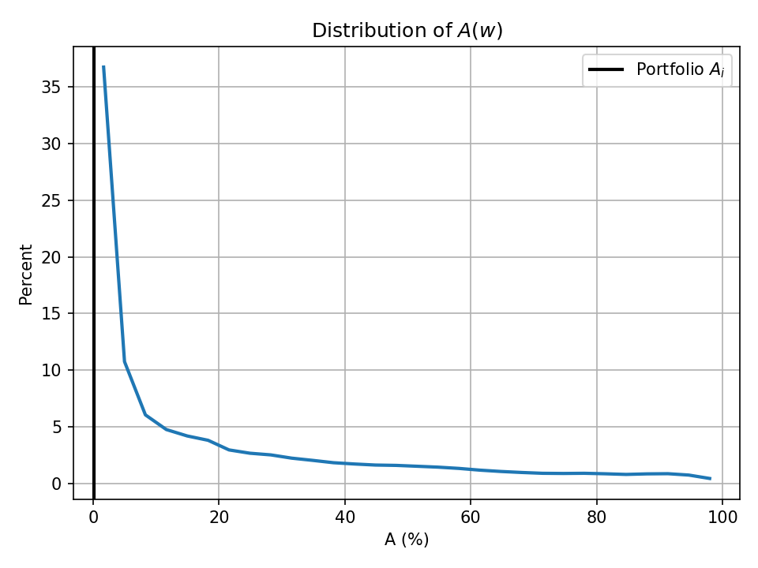

# frontier_segments

**Portfolio Efficient Frontiers & Diagnostics for Python**

A Python package for exact Markowitz mean-variance frontier computation and portfolio performance analysis. Given a vector of expected returns and a covariance matrix, `frontier_segments` traces all three frontier branches — the northwest efficient frontier (NW EF), the southwest minimum-variance frontier (SW), and the east variance-maximizing frontier (EA) — and provides a suite of absolute, quasi-relative, and relative performance measures for any observed portfolio.

---

## Installation

```bash
pip install git+https://github.com/zacharybartsch/frontier_segments.git
```

**Dependencies:** `numpy`, `scipy`, `matplotlib` (also `pandas` and `scipy.stats` if you use `q_plot`'s `stats=True` export)

---

## Quick Start

The example below uses Georgia's actual 2013 state tax revenue allocation — five consolidated tax sources (General Sales and Gross Receipts, Motor Fuels, Individual Income, Corporation Net Income, and a residual "Other" category), replicated from Bartsch (2026), *Evaluating State Tax Portfolio Performance* (Tables I–II).

```python
import numpy as np
import frontier_segments.frontier_segments as fs

# Georgia, 2013 — five consolidated tax sources
mu_GA = np.array([0.04321064, 0.09432582, 0.05994018, 0.04744774, 0.05847559])
Sigma_GA = np.array([
    [ 0.00117476, -0.00005078, -0.00047024, -0.00156685, -0.00228487],
    [-0.00005078,  0.02358429,  0.00088930, -0.00595364,  0.00263467],
    [-0.00047024,  0.00088930,  0.00245991, -0.00055711, -0.00010694],
    [-0.00156685, -0.00595364, -0.00055711,  0.03806298, -0.00113346],
    [-0.00228487,  0.00263467, -0.00010694, -0.00113346,  0.01611126],
])
w_o = np.array([0.27856823, 0.06649115, 0.49736724, 0.04979834, 0.10777504])  # observed 2013 allocation

# Step 1: compute frontiers once
cloud = fs.compute_cloud(mu_GA, Sigma_GA)

# Step 2: run diagnostics
ap = fs.absolute_performance(cloud, w_o, verbose=True)
qr = fs.quasi_relative_performance(cloud, w_o, verbose=True)
rp = fs.relative_performance(cloud, w_o, reference=True, verbose=True)

# Step 3: visualize
fs.plot_cloud(cloud, weights=w_o)

# Step 4: distribution of a relative measure over the feasible simplex
fs.q_plot(cloud, weights=w_o, stat="A")
```

---

## The Markowitz Cloud

`frontier_segments` partitions the feasible portfolio space into three frontier branches:

| Branch | Flag key | Description |
|--------|----------|-------------|
| **NW efficient frontier** | `ef_frontier` | Minimizes variance at each return level above the global minimum |
| **SW frontier** | `low_frontier` | Minimizes variance at each return level *below* the global minimum |
| **East (EA) frontier** | `ea_frontier` | Maximizes variance at each return level (outer boundary of the feasible cloud) |

Each branch is represented as a list of piecewise-parabolic segments. A segment records its active asset set, return interval `[lower_r, upper_r]`, and the parabola coefficients `a·r² + b·r + c = σ²`.

---

## API Reference

### `compute_cloud`

```python
cloud = fs.compute_cloud(mu, Sigma,
                      ef=True,            # compute NW efficient frontier
                      swf=True,           # compute SW frontier
                      east_mode="exact",  # "exact" | "grid" | False
                      east_K=200,         # grid resolution when east_mode="grid"
                      verbose=False)
```

Computes frontier segments and returns a `cloud_dict` for reuse across all diagnostics. Pass `verbose=True` to print a segment table.

**Returns** a dict with keys: `segments`, `mu`, `Sigma`, `r_global`, `N`, `chol_L`.

- `r_global` — the global minimum-variance portfolio return (MVP).
- `east_mode="exact"` enumerates all C(N, 2) asset pairs analytically; `"grid"` uses `east_K` evenly-spaced return points (faster for large N).

---

### `absolute_performance`

```python
ap = fs.absolute_performance(cloud, weights,
                          sd=True,                  # True → report std dev; False → variance
                          rf=0.0,                    # risk-free rate for Sharpe
                          reference_weights=None,    # optional benchmark
                          verbose=False)
```

Locates the observed portfolio relative to the frontier. Four frontier reference points are computed by search, plus three always-on-the-EF anchor points:

| Key | Description |
|-----|-------------|
| `frontier_same_var` | Highest-return frontier point at the same variance as `w_o` |
| `frontier_same_r` | Lowest-variance frontier point at the same return as `w_o` |
| `nearest_ef` | Nearest NW EF point in (return, σ) space (golden-section search) |
| `closest_ef_weights` | NW EF point with minimum portfolio-weight dissimilarity *D* |
| `min_var` | Global minimum-variance portfolio (`r_global`) |
| `max_return` | Single highest-return asset |
| `max_sharpe` | Tangency (max-Sharpe) portfolio at `rf` |

**Returns** a dict with keys: `r_w, var_w, sd_w, sharpe_w, rf, frontier_same_var, frontier_same_r, nearest_ef, closest_ef_weights, min_var, max_return, max_sharpe`.

**Verbose output** prints a comparison table of `w_o` against six reference portfolios (Max r\|Same σ, Min σ\|Same r, Min Var, Max Return, Max Sharpe, EF Min Diss, and optionally a reference portfolio), showing r, σ, Sharpe, and asset weights with signed deltas.

---

### `quasi_relative_performance`

```python
qr = fs.quasi_relative_performance(cloud, weights,
                                sd=True,
                                rf=0.0,
                                w_ref=None,
                                verbose=False)
```

Measures how the observed portfolio is positioned *within* the feasible return-risk cloud, returning scores in [0, 1] where **1 = best**.

**Conditional measures (rho)** — conditioned on the portfolio's own risk or return level:

| Key | Formula | Interpretation |
|-----|---------|----------------|
| `rho_r` | (r\_o − r\_min) / (r\_max − r\_min) at σ\_o | Return rank within all feasible returns at the observed σ; 1 = on EF |
| `rho_sigma` | (σ\_max − σ\_o) / (σ\_max − σ\_min) at r\_o | Risk rank within feasible σ range at the observed return; 1 = on EF |

**Unconditional measures (gamma)** — anchored to the global feasible extremes across the entire cloud:

| Key | Formula | 1 = | 0 = |
|-----|---------|-----|-----|
| `gamma_r` | (r\_o − min(μ)) / (max(μ) − min(μ)) | highest-return single asset | lowest-return single asset |
| `gamma_sigma` | (σ\_max\_global − σ\_o) / (σ\_max\_global − σ\_min\_global) | MVP | highest-variance single asset |
| `gamma_sharpe` | (SR\_o − SR\_min) / (SR\_max − SR\_min) | tangency portfolio | worst single-asset Sharpe |

where σ\_min\_global = MVP σ, σ\_max\_global = max√(diag(Σ)), SR\_max = tangency Sharpe (at `rf`), SR\_min = worst single-asset Sharpe.

**Returns** a dict with keys:

```
r_w, var_w, sd_w, sharpe_w,
rho_r, r_min_at_sigma, r_max_at_sigma,
rho_sigma, sd_min_at_r, sd_max_at_r,
gamma_r, r_min_global, r_max_global,
gamma_sigma, sd_min_global, sd_max_global,
gamma_sharpe, sharpe_min_global, sharpe_max_global,
ref_rho_r, ref_rho_sigma,
ref_gamma_r, ref_gamma_sigma, ref_gamma_sharpe,
dissim_w_ref
```

Any key is `None` when not applicable or the required frontier was not computed.

---

### `relative_performance`

```python
rp = fs.relative_performance(cloud, weights,
                          rf=0.0,
                          n_points=1_000_000,  # target lattice size for Q_A / Q_F distribution
                          lattice_k=None,      # explicit barycentric lattice resolution (overrides n_points)
                          determine=True,      # True → analytical GL quadrature; False → O(M²) lattice counting
                          n_quad=200,          # GL nodes per outer dimension
                          reference=False,     # also compute the 6 reference-portfolio columns
                          coarse=False,        # opt-in boundary-refinement for Q_A/Q_F (False | True | int)
                          w_ref=None,
                          verbose=False)
```

Evaluates the observed portfolio against the uniform distribution over all long-only portfolios on the probability simplex W\_s = {w ≥ 0, **1**'w = 1}.

**Univariate statistics** (each in [0, 1]; higher = better):

| Key | Definition |
|-----|-----------|
| `P_r_minus` | Pr\_w(r(w) < r\_o) — fraction of simplex beaten in return |
| `P_sigma_plus` | Pr\_w(σ(w) > σ\_o) — fraction of simplex beaten in risk |
| `P_sharpe_minus` | Pr\_w(SR(w) < SR(w\_o)) — fraction of simplex beaten in Sharpe ratio |

**Domination-region statistics:**

| Key | Definition | Interpretation |
|-----|-----------|----------------|
| `A_i` | Pr\_w(r(w) > r\_o **and** σ(w) < σ\_o) | Area of simplex that *dominates* w\_o; 0 on the EF |
| `F_i` | Pr\_w(r(w) < r\_o **and** σ(w) > σ\_o) | Area of simplex that w\_o *dominates* |
| `Q_A` | Pr\_w(A(w) ≥ A(w\_o)) | Upper-tail rank of A\_i; → 1 means w\_o is near the EF |
| `Q_F` | Pr\_w(F(w) ≤ F(w\_o)) | Lower-tail rank of F\_i; → 1 means w\_o dominates most portfolios |

`P_r_minus` and `P_sigma_plus` are computed analytically (exact). `P_sharpe_minus` uses exact closed-form formulas for N ≤ 4 and Gauss-Legendre quadrature for N > 4. `A_i`/`F_i` are always computed from a single fused quadrature pass (both from the same per-node return-and-variance solve, rather than two independent passes), with dominance-membership skips applied where a single threshold's `Q_A`/`Q_F` is evaluated directly.

**`reference=False`** (default) computes only `w_o`'s own measures — the cheap path. **`reference=True`** additionally computes the 6 reference-portfolio columns (max-return-conditional, min-variance-conditional, global min variance, global max return, max Sharpe, min-D EF allocation), mirroring `absolute_performance`, and adds a `reference_columns` key (a list of per-portfolio dicts) to the returned result. `verbose` only controls printing — it's independent of `reference`. Four of the six reference portfolios sit exactly on the NW EF by construction, so `A_i=0`/`Q_A=1` for them is known without any lattice evaluation; only the two conditional reference points (plus `w_o` and an optional `w_ref`) can genuinely sit off the EF and need real `A`/`Q_A` computation, while `F`/`Q_F` always needs real computation for every column. This asymmetry is why the shared-distribution computation (built once per call and reused across every column, rather than resampling the lattice per reference portfolio) benefits `F` unconditionally, while `A` can still benefit from `coarse` boundary refinement even under `reference=True`.

**`coarse`** is an opt-in alternative to full-lattice evaluation for a single threshold's `Q_A`/`Q_F`: a coarse sub-lattice is classified above/below the threshold first, and only fine lattice points near the resulting contour are evaluated exactly. `False`/`None` (default) skips it — exact direct evaluation. `True` uses a default coarse resolution derived from the fine lattice; an `int` sets it explicitly. This trades a small, validated resolution tolerance for a large speedup on big lattices; validate a chosen resolution with `validate_coarse_halving` before trusting it for reporting.

**Returns** a dict with keys: `r_w, var_w, sd_w, P_r_minus, P_sigma_plus, P_sharpe_minus, A_i, F_i, Q_A, Q_F`, and (only when `reference=True`) `reference_columns`.

---

### `plot_cloud`

```python
fs.plot_cloud(cloud,
           weights=None,        # observed portfolio — plotted as an open circle
           ref_weights=None,    # benchmark portfolio — plotted as a filled circle
           sd=True,             # x-axis: std dev (True) or variance
           num_points=200,      # curve resolution
           show_assets=True,    # show individual asset markers
           show_targets=True,   # scatter the 6 reference portfolios when weights is given
           xlim=None, ylim=None,
           percent=False,       # multiply axis values by 100
           bw=False,            # black-and-white mode
           lw=2, asset_size=36, target_size=80, target_color="black",
           title_size=None, axis_title_size=None, label_size=None, tick_step=None,
           xtitle=None, ytitle=None,
           show_legend=True, show=True,
           save=None, dpi=150,  # save the figure to a file
           rf=0.0)              # risk-free rate, used to locate the Max Sharpe target
```

Plots the three frontier branches and (optionally) the observed and reference portfolios on a return-vs-risk diagram. Returns `(fig, ax)`.

- **Blue solid** — NW efficient frontier
- **Green dashed** — SW frontier
- **Red dotted** — East (EA) frontier
- **■** — individual assets
- **○** — observed portfolio
- **●** — reference (benchmark) portfolio
- **+** — the 6 reference portfolios (only when `weights` and `show_targets=True`)

> **Known issue:** the `+` target markers (`show_targets=True`) currently render oversized — `target_size` is passed straight through to `markersize`, a linear point-size unit, rather than the area-like unit used for `asset_size`/`target_size` elsewhere via `ax.scatter`. Pass `show_targets=False` until this is fixed, or expect very large crosses.

---

### `q_plot`

```python
fs.q_plot(cloud, weights,
      stat="A",             # "A" | "F" | "return" | "sigma" | "sharpe"
      n_points=1_000_000,   # target lattice size; ignored when lattice_k is given
      lattice_k=None,       # explicit barycentric lattice resolution
      determine=True,       # analytical GL quadrature vs. O(M²) lattice counting, for A/F
      n_quad=200,
      rf=0.0,                # only used when stat="sharpe"
      bins=30, width=None,   # bin count, or explicit bin width (overrides bins)
      xlim=None, ylim=None,
      percent=True,          # multiply values by 100 (ignored for "sharpe")
      bw=False, lw=2,
      title_size=None, axis_title_size=None, label_size=None, tick_step=None,
      target_color="black", xtitle=None, ytitle=None,
      show=True, show_legend=True,
      save=None, dpi=150,     # save the figure to a file
      graph=True,             # draw/show/save the histogram
      stats=False,            # export descriptive statistics to an Excel workbook
      stats_save=None,        # workbook path (defaults from save, or "q_plot_stats.xlsx")
      stats_sheet=None)       # sheet name (defaults to "{STAT} distribution")
```

Histograms a portfolio statistic sampled over the same barycentric lattice used by `relative_performance`'s `Q_A`/`Q_F`, drawn as a frequency polygon (a line through each bin's midpoint) rather than bars, with the observed portfolio's own value marked as a vertical line. `stat="A"`/`"F"` histogram the same domination-region measures as `relative_performance`; `"return"`, `"sigma"`, and `"sharpe"` histogram the portfolio's own return, standard deviation, or Sharpe ratio across the simplex. Returns `(fig, ax)`, or `(None, None)` when `graph=False`.

Set `stats=True` to additionally export N, Min, the 10th–90th percentiles (deciles), Max, Mean, Std Dev, Skewness, and excess Kurtosis (normal = 0) to an Excel sheet, computed on the same values shown in the histogram. Calling `q_plot` multiple times with the same `stats_save` path (e.g. once per state in a loop) accumulates each call onto its own sheet in one shared workbook — give each call a distinct `stats_sheet` name to avoid collisions.

---

## Full Example with Output

```python
import numpy as np
import frontier_segments.frontier_segments as fs

mu_GA = np.array([0.04321064, 0.09432582, 0.05994018, 0.04744774, 0.05847559])
Sigma_GA = np.array([
    [ 0.00117476, -0.00005078, -0.00047024, -0.00156685, -0.00228487],
    [-0.00005078,  0.02358429,  0.00088930, -0.00595364,  0.00263467],
    [-0.00047024,  0.00088930,  0.00245991, -0.00055711, -0.00010694],
    [-0.00156685, -0.00595364, -0.00055711,  0.03806298, -0.00113346],
    [-0.00228487,  0.00263467, -0.00010694, -0.00113346,  0.01611126],
])
w_o = np.array([0.27856823, 0.06649115, 0.49736724, 0.04979834, 0.10777504])

cloud = fs.compute_cloud(mu_GA, Sigma_GA, verbose=True)
```

Assets, in order: **T09** General Sales and Gross Receipts Taxes, **T13** Motor Fuels Sales Tax, **T40** Individual Income Taxes, **T41** Corporation Net Income Taxes, **Other**.

**`compute_cloud` verbose output:**

```
N         : 5
r_global  : 0.049239
mu        : [0.04321064 0.09432582 0.05994018 0.04744774 0.05847559]
Sigma     :
[[ 1.174760e-03 -5.078000e-05 -4.702400e-04 -1.566850e-03 -2.284870e-03]
 [-5.078000e-05  2.358429e-02  8.893000e-04 -5.953640e-03  2.634670e-03]
 [-4.702400e-04  8.893000e-04  2.459910e-03 -5.571100e-04 -1.069400e-04]
 [-1.566850e-03 -5.953640e-03 -5.571100e-04  3.806298e-02 -1.133460e-03]
 [-2.284870e-03  2.634670e-03 -1.069400e-04 -1.133460e-03  1.611126e-02]]
chol_L    :
[[ 0.03427477  0.          0.          0.          0.        ]
 [-0.00148156  0.15356463  0.          0.          0.        ]
 [-0.01371971  0.00565868  0.04732503  0.          0.        ]
 [-0.04571438 -0.03921065 -0.02033633  0.1844509   0.        ]
 [-0.06666332  0.0165136  -0.02356019 -0.02175403  0.10181475]]
segments  : 11 total
  active_set           lower_r     upper_r   ef   sw   ea
  -------------------------------------------------------
  (0, 3)              0.043211    0.043393    0    1    0
  (0, 3, 4)           0.043393    0.044985    0    1    0
  (0, 2, 3, 4)        0.044985    0.049076    0    1    0
  (0, 1, 2, 3, 4)     0.049076    0.049239    0    1    0
  (0, 1, 2, 3, 4)     0.049239    0.067958    1    0    0
  (1, 2, 3, 4)        0.067958    0.076171    1    0    0
  (1, 2, 3)           0.076171    0.084663    1    0    0
  (1, 2)              0.084663    0.094326    1    0    0
  (0, 3)              0.043211    0.047448    0    0    1
  (1, 3)              0.047448    0.080324    0    0    1
  (0, 1)              0.080324    0.094326    0    0    1
```

```python
ap = fs.absolute_performance(cloud, w_o, verbose=True)
```

**`absolute_performance` verbose output:**

```
--- absolute_performance ---
  rf = 0.000000
           asset |   w_o    |     Max r|Same sd          Min sd|Same r             Min Var              Max Return             Max Sharpe             EF Min Diss      
  ---------------------------------------------------------------------------------------------------------------------------------------------------------------------
               r | 0.056786 |  0.057460  +0.000674 |  0.056786  +0.000000 |  0.049239  -0.007547 |  0.094326  +0.037540 |  0.050042  -0.006744 |  0.059341  +0.002555 |
              sd | 0.027903 |  0.027903  +0.000000 |  0.026483  -0.001420 |  0.016950  -0.010953 |  0.153572  +0.125669 |  0.017087  -0.010815 |  0.032081  +0.004178 |
          sharpe | 2.035166 |  2.059305  +0.024139 |  2.144257  +0.109091 |  2.905021  +0.869855 |  0.614213  -1.420952 |  2.928601  +0.893436 |  1.849741  -0.185425 |
  ---------------------------------------------------------------------------------------------------------------------------------------------------------------------
  weights      0 | 0.278568 |  0.339401  +0.060833 |  0.361176  +0.082608 |  0.605161  +0.326593 |  0.000000  -0.278568 |  0.579214  +0.300646 |  0.278568  -0.000000 |
               1 | 0.066491 |  0.113104  +0.046613 |  0.104017  +0.037526 |  0.002198  -0.064293 |  1.000000  +0.933509 |  0.013026  -0.053465 |  0.138491  +0.071999 |
               2 | 0.497367 |  0.414764  -0.082604 |  0.400881  -0.096486 |  0.245330  -0.252037 |  0.000000  -0.497367 |  0.261872  -0.235495 |  0.453547  -0.043820 |
               3 | 0.049798 |  0.045079  -0.004720 |  0.044630  -0.005169 |  0.039601  -0.010197 |  0.000000  -0.049798 |  0.040136  -0.009662 |  0.046332  -0.003466 |
               4 | 0.107775 |  0.087653  -0.020122 |  0.089296  -0.018479 |  0.107710  -0.000065 |  0.000000  -0.107775 |  0.105751  -0.002024 |  0.083062  -0.024713 |
```

```python
qr = fs.quasi_relative_performance(cloud, w_o, verbose=True)
```

**`quasi_relative_performance` verbose output:**

```
--- quasi_relative_performance ---
            stat |   w_o    |     Max r|Same sd          Min sd|Same r             Min Var              Max Return             Max Sharpe             EF Min Diss      
  ---------------------------------------------------------------------------------------------------------------------------------------------------------------------
           rho_r | 0.949825 |  1.000000  +0.050175 |  1.000000  +0.050175 |  1.000000  +0.050175 |  1.000000  +0.050175 |  1.000000  +0.050175 |  1.000000  +0.050175 |
          rho_sd | 0.988790 |  1.000000  +0.011210 |  1.000000  +0.011210 |  1.000000  +0.011210 |  1.000000  +0.011210 |  1.000000  +0.011210 |  1.000000  +0.011210 |
  ---------------------------------------------------------------------------------------------------------------------------------------------------------------------
         gamma_r | 0.265589 |  0.278766  +0.013177 |  0.265589  +0.000000 |  0.117941  -0.147647 |  1.000000  +0.734411 |  0.133643  -0.131945 |  0.315579  +0.049990 |
        gamma_sd | 0.938518 |  0.938518  +0.000000 |  0.946487  +0.007969 |  1.000000  +0.061482 |  0.233096  -0.705422 |  0.999228  +0.060709 |  0.915063  -0.023455 |
    gamma_sharpe | 0.667299 |  0.676288  +0.008989 |  0.707923  +0.040624 |  0.991219  +0.323920 |  0.138159  -0.529140 |  1.000000  +0.332701 |  0.598250  -0.069049 |
  ---------------------------------------------------------------------------------------------------------------------------------------------------------------------
   dissimilarity | 0.000000 |  0.107446            |  0.120134            |  0.326593            |  0.933509            |  0.300646            |  0.071999            |
```

**Reading the table.** Each column is a reference portfolio. Signed deltas show how that portfolio's score differs from `w_o`. The `rho` rows are each 1.0 for every frontier portfolio by construction — they serve as a sanity check that the frontier point was found correctly. The `gamma` rows are unconditional: `gamma_r = 1` only for the single asset with the highest expected return, `gamma_sd = 1` only for the MVP, and `gamma_sharpe = 1` only for the tangency (Max Sharpe) portfolio. Georgia's 2013 allocation scores `gamma_r = 0.266` — its revenue growth was far below what was achievable elsewhere in the feasible set — despite scoring `gamma_sd = 0.939` (risk close to the global minimum) and a moderate `gamma_sharpe = 0.667`, illustrating that low absolute growth need not reflect a policy defect: greater growth was possible, but only at higher volatilities than were realized.

```python
rp = fs.relative_performance(cloud, w_o, reference=True, verbose=True)
```

**`relative_performance` verbose output:**

```
--- relative_performance ---
            stat |   w_o    |     Max r|Same sd          Min sd|Same r             Min Var              Max Return             Max Sharpe             EF Min Diss      
  ---------------------------------------------------------------------------------------------------------------------------------------------------------------------
       P_r_minus | 0.336172 |  0.378136  +0.041964 |  0.336172  +0.000000 |  0.023505  -0.312667 |  1.000000  +0.663828 |  0.037717  -0.298454 |  0.492899  +0.156727 |
    P_sigma_plus | 0.960539 |  0.960539  +0.000000 |  0.973057  +0.012517 |  1.000000  +0.039461 |  0.001475  -0.959065 |  0.999929  +0.039390 |  0.935979  -0.024560 |
  P_sharpe_minus | 0.971592 |  0.973959  +0.002367 |  0.984606  +0.013015 |  1.000000  +0.028408 |  0.089430  -0.882162 |  1.000000  +0.028408 |  0.953474  -0.018118 |
             A_i | 0.000926 |  0.000000  -0.000926 |  0.000000  -0.000926 |  0.000000  -0.000926 |  0.000000  -0.000926 |  0.000000  -0.000926 |  0.000000  -0.000926 |
             F_i | 0.301521 |  0.343378  +0.041857 |  0.313112  +0.011592 |  0.023470  -0.278051 |  0.001475  -0.300046 |  0.039238  -0.262282 |  0.422563  +0.121042 |
  ---------------------------------------------------------------------------------------------------------------------------------------------------------------------
             Q_A | 0.881989 |  1.000000  +0.118011 |  1.000000  +0.118011 |  1.000000  +0.118011 |  1.000000  +0.118011 |  1.000000  +0.118011 |  1.000000  +0.118011 |
             Q_F | 0.777843 |  0.843824  +0.065982 |  0.797084  +0.019242 |  0.096202  -0.681641 |  0.014145  -0.763697 |  0.148869  -0.628974 |  0.935509  +0.157666 |
```

`reference=True` picked a lattice resolution of `k=67` (`_simplex_grid: k=67, points=971635`), auto-derived from the default `n_points=1_000_000` for this 5-asset feasible set — matching the resolution reported in Bartsch (2026), Table V. Georgia's 2013 allocation is dominated by only `A_i = 0.09%` of the feasible simplex, and itself dominates `F_i = 30.2%` of it — the 2013 allocation sits almost exactly on the efficient frontier (visible in the plot below), while still being strictly superior to nearly a third of all other feasible tax-source weightings.

```python
fs.plot_cloud(cloud, weights=w_o)
```

**Plot:**


```python
fs.q_plot(cloud, weights=w_o, stat="A")
```

**Plot — distribution of `A(w)` over the feasible simplex, with Georgia's 2013 `A_i` marked:**



About 10.3% of the simplex has `A(w) ≈ 0` (i.e. also sits on the EF); the observed allocation's own `A_i ≈ 0.09%` lands at the very left edge of the distribution, consistent with the near-zero value in the table above.

---

## Technical Notes

### Frontier Computation

The west frontier (NW EF + SW) is computed by a piecewise critical-line algorithm. Starting from the full-asset active set at the global MVP, assets enter and exit the active set at breakpoint returns where a weight hits zero or a shadow price changes sign. Each active set yields an exact parabolic segment in (return, variance) space.

The east frontier is computed by finding, at each return level, the two-asset combination with the *highest* variance. With `east_mode="exact"` all C(N, 2) asset pairs are examined analytically; with `east_mode="grid"` a K-point return grid is used.

### Dissimilarity

Portfolio dissimilarity between w\_a and w\_b is defined as:

> D(w\_a, w\_b) = ½ · Σ |w\_a,i − w\_b,i|

This equals the total rebalancing required to move from one portfolio to the other (one-way turnover). It lies in [0, 1] for long-only portfolios.

### Simplex Geometry

All relative performance measures are computed analytically (no Monte Carlo sampling) for any number of assets N:

- **P\_r\_minus** — exact polytope volume via `scipy.spatial.ConvexHull`.
- **P\_sigma\_plus** and **P\_sharpe\_minus** — Gauss-Legendre quadrature via the Duffy transform. The σ² and Sharpe-ratio conditions each reduce to a quadratic inequality in the innermost simplex coordinate, solved analytically at each quadrature node.
- **A\_i**, **F\_i**, **Q\_A**, **Q\_F** — iterated Gauss-Legendre quadrature via the Duffy transform on the (N−2)-simplex, with a deterministic barycentric lattice for the Q statistics. A single fused quadrature pass produces `A_i` and `F_i` together (they are disjoint sub-intervals of the same per-node segment sweep). For a single threshold's `Q_A`/`Q_F`, dominance-membership skips certify some lattice points without evaluating them, and an opt-in boundary-refinement scheme (`coarse=`) further restricts exact evaluation to fine lattice points near the `A(w) = A(w_o)` contour — see the `relative_performance` docstring for the exactness conditions.

---

## Citation

> Bartsch, Zachary. 2026. "Portfolio Efficient Frontiers & Diagnostics for Python."  
> Ave Maria University. https://github.com/zacharybartsch/frontier_segments

The worked example above replicates data and results from:

> Bartsch, Zachary. 2026. "Evaluating State Tax Portfolio Performance." Ave Maria University.

---

## License

MIT
